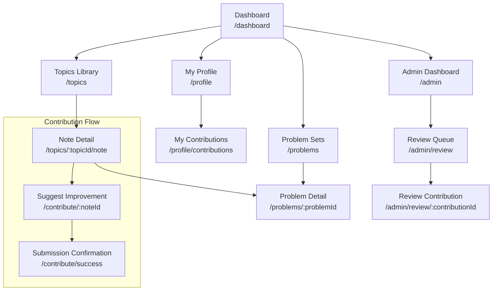

# User Flow — SmartInterviews Hub

```mermaid
graph TD
  %% Primary Pages
  Dashboard["Dashboard<br/>/dashboard"]
  Topics["Topics Library<br/>/topics"]
  Problems["Problem Sets<br/>/problems"]
  Profile["My Profile<br/>/profile"]

  %% Knowledge Discovery & Reading Flow
  Dashboard --> Topics
  Topics --> NoteDetail["Note Detail<br/>/topics/:topicId/note"]

  %% Core Business Feature: Community Contribution
  subgraph "Contribution Flow"
    NoteDetail --> ContributionForm["Suggest Improvement<br/>/contribute/:noteId"]
    ContributionForm --> ContributionSuccess["Submission Confirmation<br/>/contribute/success"]
  end

  %% Problem Practice Flow
  Dashboard --> Problems
  Problems --> ProblemDetail["Problem Detail<br/>/problems/:problemId"]

  %% Cross-navigation
  NoteDetail --> ProblemDetail

  %% Admin Functionality
  Dashboard --> AdminDashboard["Admin Dashboard<br/>/admin"]
  AdminDashboard --> ReviewQueue["Review Queue<br/>/admin/review"]
  ReviewQueue --> ReviewDetail["Review Contribution<br/>/admin/review/:contributionId"]

  %% Profile & Progress
  Dashboard --> Profile
  Profile --> Contributions["My Contributions<br/>/profile/contributions"]
```
